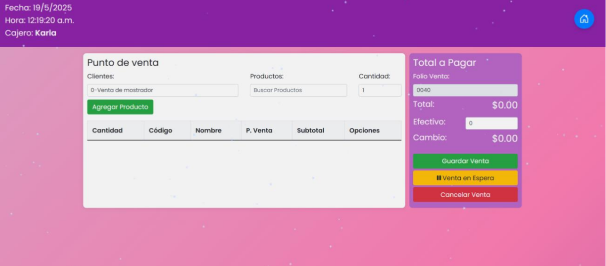

# VentaSmart – Web POS System

VentaSmart is a web-based Point of Sale (POS) system designed to manage sales, inventory, customers, and suppliers for small retail businesses.

This project was developed as part of a university software development project.

---

## Features

* Product management
* Customer management
* Supplier management
* Sales registration
* Inventory control
* Sales reports
* Cash register system

---

## Technologies Used

### Frontend

* HTML
* CSS
* JavaScript

### Backend

* PHP

### Database

* MySQL

---

## Project Structure

database/ → SQL database
docs/ → Project documentation
images/ → Screenshots of the system
img/ → System interface images
funciones/ → Backend functions

---

## Database

The database schema can be found in:

database/venta_smart.sql

The database includes tables for:

* Products
* Customers
* Suppliers
* Sales
* Inventory
* Users

---

## Documentation

Project documentation is available in the **docs** folder:

* System documentation
* Installation manual
* User manual
* Testing and deployment documentation

---

## Screenshots

### Login

### Dashboard

### Sales Module

---

## Author

Daniela Sepúlveda Gómez
Computer Systems Engineering Student
